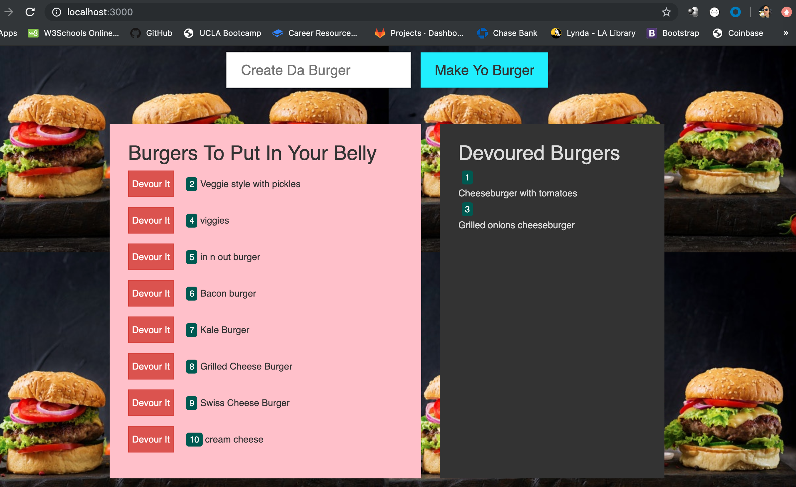

# EatDaBurger

### Create custom burgers, eat burgers, and view burgers and best yet - DON'T WORRY ABOUT THE CALORIES!

## Live Link
### Heroku
https://mighty-basin-61345.herokuapp.com/

### GitHub
https://thatianaviana.github.io/EatDaBurger/

I am not sure why Heroku link and Github Links aren't working, but here's the screenshot from the HW in my computer:

## How it Works

To use the web app, simply start adding burgers and eating as you'd like. 

## Requirements

* Allow user to add burgers
* Display existing and added burgers to the left-hand side of the app with a corresponding "EAT" button
* Display devoured burgers to the right-hand side of the app
* Store all burgers and their devoured state in a database

## Technologies Used

* JavaScript
* Node
* Express
* Handlebars
* MVC
